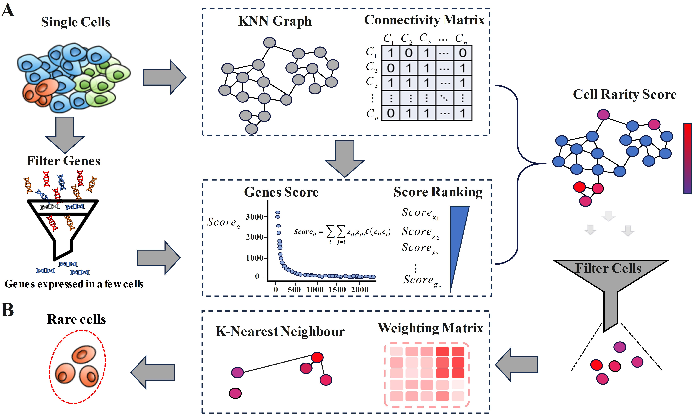
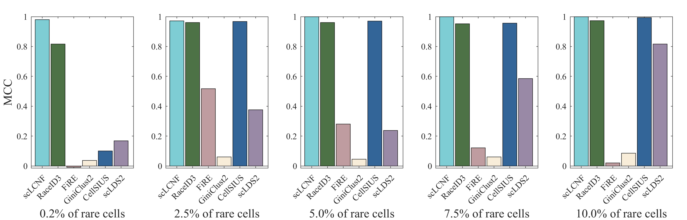

# scLCNF
## scLCNF: Connectivity network feature sharing in single-cell RNA sequencing data identifies rare cells

## Installation
### Required R modules
```
R >= 4.1.0
```
## R packages prerequisites
```
Seurat
ggplot2
Matrix
rflann
irlba
e1071
```

## Overview
scLCNF is a new method for identifying rare cells by analyzing the features that are uniquely expressed in these cells. scLCNF creates a network of cellular connections that takes into account the relationship of each cell to its neighbors. The network helps pinpoint co-expression patterns unique to rare cells, using rarity scores to confirm their presence.\
 
## Performance evaluation
  
  
  In terms of rare cell detection, scLCNF offers best performance compared with other methods.
  
 
 

